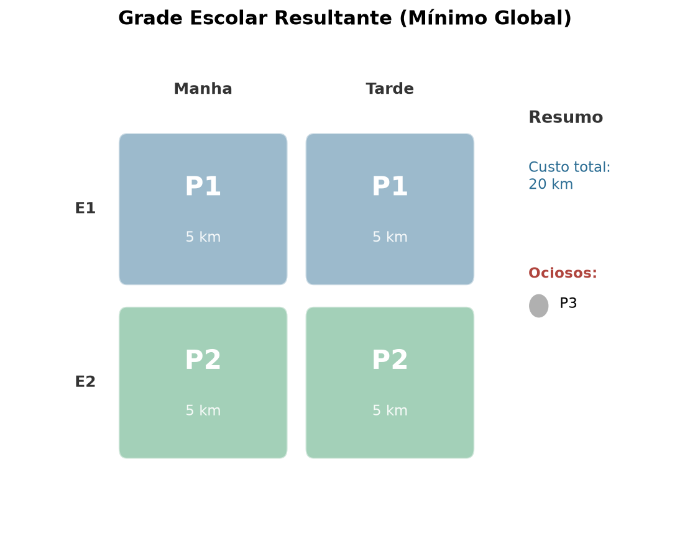
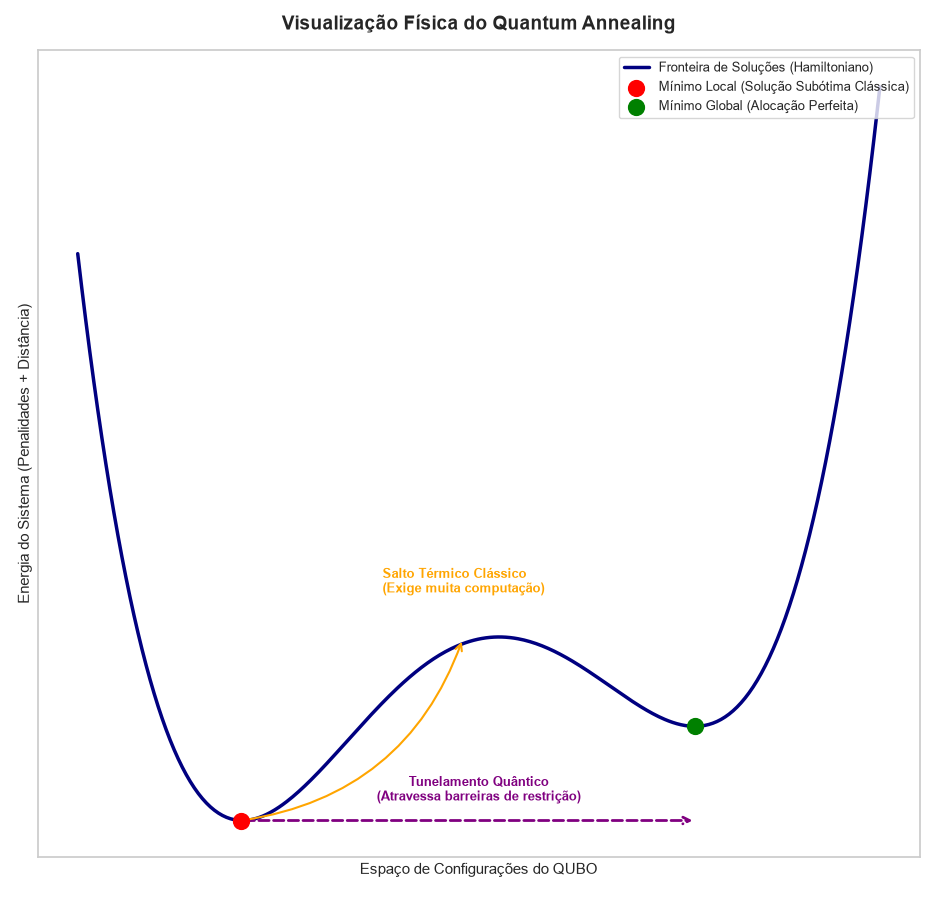

# A otimização da alocação dos professores nas escolas.⚛️🎓


## 📌 Sobre o Projeto

Este repositório contém um simulador prático de otimização combinatória inspirado em desafios discutidos no **Brazil Quantum Camp**. O objetivo deste sistema é demonstrar como problemas do tipo NP-Difícil no setor logístico público podem ser equacionados na Era NISQ (*Noisy Intermediate-Scale Quantum*). 

Aqui, abordamos a **Alocação de Professores em Escolas Públicas**, visando minimizar o custo total de deslocamento, sem quebrar os limites físicos ou temporais de cada professor, usando as bases da mecânica quântica aplicadas a computação (Quantum Annealing).

## 🧮 A Matemática Quântica (A Modelagem QUBO)

Para que o problema logístico seja solucionável por um computador analógico (como os da D-Wave), o ambiente foi mapeado em um **Hamiltoniano** usando uma matriz **QUBO** (*Quadratic Unconstrained Binary Optimization*). 

- **Soft Constraint (O Objetivo):** Nós queremos o caminho mais curto. Multiplicamos a alocação binária pela distância na forma de *pesos lineares*. Quanto maior o deslocamento, mais "energia" é gasta — e o Annealer tende a buscar sempre o nível mais baixo de energia.
- **Hard Constraints (As Regras Rígidas):** 
  Para evitar distorções lógicas, inserimos barreiras de energia gigantescas (penalidades de +100).
  1. *A Regra de Ocupação:* Um e apenas um professor por escola e por horário. `(Soma - 1)² = 0`
  2. *A Onipresença Impossível:* Penalizamos os termos de iteração quadrática caso a matriz tente alocar o mesmo professor `p` nas escolas `E1` e `E2` simultaneamente.

## 📈 Visualização: A Paisagem de Energia

O projeto conta com ferramentas analíticas visuais focadas em entender a teoria por trás da execução:

1. **Grade Otimizada:** Um Heatmap claro com a escala gerada.
2. **Paisagem de Energia:** Um gráfico comparativo elucidando as dinâmicas de tunelamento. Mostramos o contraste entre um algoritmo de minimização clássica caindo na armadilha de um **Mínimo Local** e o uso do **Tunelamento Quântico** (Quantum Tunneling) para perfurar a barreira de energia direto até o **Mínimo Global**.

  
*(Exemplo visual da Alocação final, a cor não importa, o peso é o professor)*

  
*(Paisagem de Energia de um Hamiltoniano e suas restrições)*

## 🚀 Como Executar

1. Clone este repositório para o seu ambiente local:
```bash
git clone https://github.com/seu-usuario/quantum-teacher-routing.git
cd quantum-teacher-routing
```

2. Crie e ative um ambiente virtual (Recomendado):
```bash
# Criação do ambiente
python -m venv .venv

# Ativação no Windows (PowerShell)
.\.venv\Scripts\activate

# Ativação no Linux/macOS
source .venv/bin/activate
```

3. Instale o ecossistema necessário contido no arquivo `requirements.txt`:
```bash
pip install -r requirements.txt
```

4. Execute o Solver através do terminal (ou rode pelo painel principal da IDE Spyder):
```bash
python src/qubo_teacher_allocation.py
```

## 🛠 Tecnologias Utilizadas

- **D-Wave Ocean SDK (`dimod` e `neal`):** Mapeamento físico do Hamiltoniano para tensores BQM e resolução via Simulated Annealing.
- **Python:** Base lógica e orquestração.
- **NumPy & Pandas:** Tensores matriciais, dataframes de custo e grafos lógicos do negócio.
- **Matplotlib & Seaborn:** Engenharia gráfica e plotagem térmica da eficiência da função.
